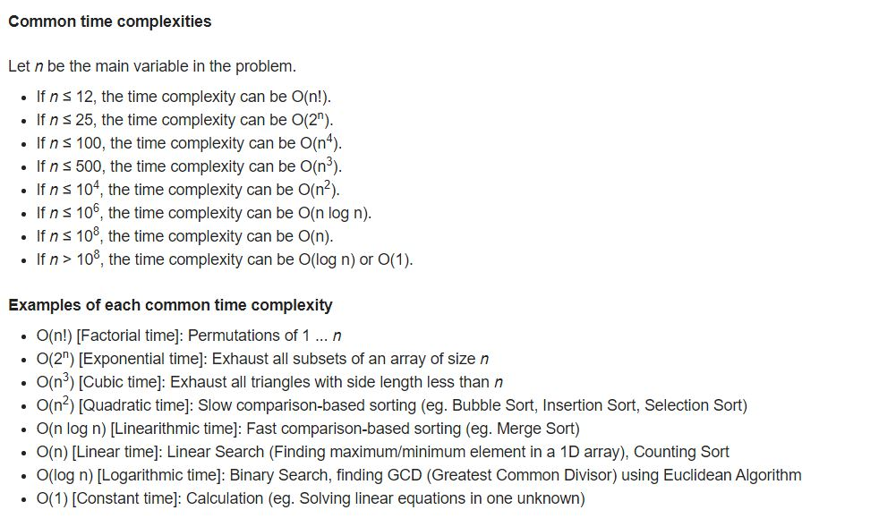

# -100dayscodingchallenge

* THIS IS THE REPO FOR YOUR NEXT **CODING INTERVIEWS / TECHNICAL INTERVIEWS / CODING ASSESSMENT / COMPETITIVE PROGRAMMING CHALLENGES** .   
* START IT WITH A CHALLENGE OF #100DAYS AND THEN YOU WILL AUTOMATICALLY FEEL THE MAGIC OF THE CODING QUESTIONS AND YOU WILL GO ON AND ON.   
* YOU MAY WISH TO SHOW YOUR PROGRESS TO THE WORLD BY TWEETING _#100DaysOfCode_ DAILY SHOWCASING YOUR WORK.

NOTE : There is no substitute of Hard-Work. Choose any programming language and start.   
For beginners you may choose either of them : 
* _Python_
* _JavaScript_ 
* _C/C++_   
* _Java_  
These are the languages which have most active community support and most likely of interviewers also knowing these.

### Good resources    

## For learning to code : 

> https://www.w3schools.com/  
> https://www.freecodecamp.org/   
> Docs for the language chosen by you available on their website.   

## For more challenges / problems : 

> https://codeforces.com/blog/entry/23204  
> https://codeforces.com/blog/entry/57282   
> https://www.topcoder.com/community/competitive-programming/tutorials/     
> https://www.geeksforgeeks.org/    
> https://www.hackerearth.com/codearena/   
> https://www.hackerrank.com/interview/interview-preparation-kit    
> https://leetcode.com/    
> https://www.dailycodingproblem.com/    
> https://www.interviewcake.com/    
> https://www.interviewbit.com/     
> https://projecteuler.net/    
> https://www.teamblind.com/post/New-Year-Gift---Curated-List-of-Top-75-LeetCode-Questions-to-Save-Your-Time-OaM1orEU  
> https://cses.fi/problemset/

## curated list of challenges : 
> https://leetcode.com/discuss/general-discussion/460599/blind-75-leetcode-questions
> https://www.techinterviewhandbook.org/grind75

## For solutions / better explanations / video solutions : 

> [TECH DOSE](https://www.youtube.com/channel/UCnxhETjJtTPs37hOZ7vQ88g)    
> [Prakash Shukla](https://www.youtube.com/channel/UCFWyB8U_DiaHf_TbG6sWLfQ)   
> [Aditya Verma](https://www.youtube.com/channel/UC5WO7o71wvxMxEtLRkPhiQQ)    
> [Nick White](https://www.youtube.com/channel/UC1fLEeYICmo3O9cUsqIi7HA)    
> [Gaurav Sen](https://www.youtube.com/channel/UCRPMAqdtSgd0Ipeef7iFsKw)    
> [Rachit Jain](https://www.youtube.com/channel/UC9fDC_eBh9e_bogw87DbGKQ)   

## For Online Virtual Interviews : 

> [Love Babbar](https://www.youtube.com/channel/UCQHLxxBFrbfdrk1jF0moTpw)   
> [Pramp](https://www.youtube.com/channel/UCe4-BhJ5DYy3TY3_ctZMdRg)    
> [Interviewing.io](https://www.youtube.com/channel/UCNc-Wa_ZNBAGzFkYbAHw9eg)    
> [Algo Expert](https://www.youtube.com/channel/UCaO6VoaYJv4kS-TQO_M-N_g)     

* [Note] : Solutions are not only code ! It contains complete detailed explanation as if I am explaining it in the interview with lots of I/O examples, intutions about different approaches and space-time tradeoffs discussions.      

* Earlier it was only for motivation for getting started, now it has gone past 100 days and going for more and more problems.     
* Questions are almost all of taken from actual Interview problems and sources include but not limited to geeksforgeeks, leetcode, interviewbit.com, codeforces, codingBlocks etc..

## System Design resources :

> [Complete list of topics/packages](https://github.com/donnemartin/system-design-primer)
> [Curated list of topics](https://github.com/shashank88/system_design)
> [Complete list of tech blogs sorted](https://github.com/kilimchoi/engineering-blogs)
> [Uber engineering](https://eng.uber.com/)
> [AirBnB engineering](https://medium.com/airbnb-engineering)
> [Meta/facebook engineering](https://engineering.fb.com/)
> [Google engineering](https://developers.googleblog.com/)
> [Quora engineering](https://quoraengineering.quora.com/)
> [Databricks engineering](https://databricks.com/blog/category/engineering)
> [Netflix engineering](https://netflixtechblog.medium.com/)
> [LinkedIn engineering](https://engineering.linkedin.com/)
> [Amazon AWS engineering](https://aws.amazon.com/blogs/architecture/)
> [PinInterest engineering](https://medium.com/@Pinterest_Engineering)
> [Lyft engineering](https://eng.lyft.com/)
> [DropBox engineering](https://dropbox.tech/)
> [Instagram engineering](https://instagram-engineering.com/)
> [Flickr engineering](https://code.flickr.net/)
> [Yelp engineering](https://engineeringblog.yelp.com/)
> [Microsoft engineering](https://devblogs.microsoft.com/engineering-at-microsoft/category/engineering-at-microsoft/)
> [Twitter engineering](https://blog.twitter.com/engineering/en_us)
> [Github engineering](https://github.blog/category/engineering/)
> [Adobe engineering](https://medium.com/adobetech)
> [Spotify engineering](https://engineering.atspotify.com/)
> [SoundCloud engineering](https://developers.soundcloud.com/blog/)
> [Criteo engineering](https://medium.com/criteo-labs)
> [Google SRE Book](https://sre.google/sre-book/table-of-contents/)
> [Netflix Rate limiter performance load](https://netflixtechblog.medium.com/performance-under-load-3e6fa9a60581)

## System design videos : 

> https://www.youtube.com/c/ArpitBhayani/videos
> https://www.youtube.com/c/sudoCODE
> https://www.youtube.com/c/codeKarle
> https://www.youtube.com/c/GauravSensei
> https://www.youtube.com/c/HusseinNasser-software-engineering/videos
> https://www.youtube.com/c/RachitJain

🌟 the repo for your next interview !  
